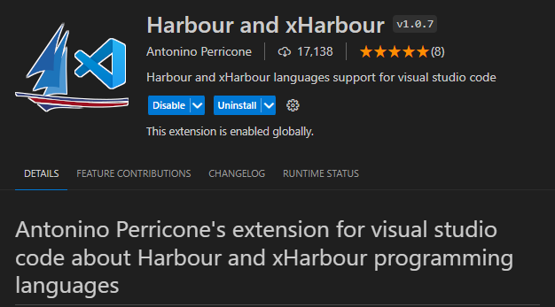

# Documentación del Proyecto

## Índice

1. [Introducción](#1-introducción)
2. [Instalación](#2-instalación)
3. [Uso](#3-Uso)
4. [Estructura](#4-Estructura del Proyecto)


## 1. Introducción ¿Cómo funciona Clipper?

¿Cómo funciona Clipper?
1. Lenguaje de Programación:

Clipper es un lenguaje de programación procedural diseñado principalmente para el desarrollo de aplicaciones de bases de datos.
Se utiliza para crear aplicaciones de software que interactúan con bases de datos de xBase, como dBASE o FoxPro.

2. Características Principales:

Procedural: Clipper sigue un enfoque procedural en la programación, similar a otros lenguajes de esa época.

Manejo de Bases de Datos: Es conocido por su capacidad para interactuar con bases de datos de forma eficiente.

Sintaxis Simple: La sintaxis de Clipper es relativamente simple y directa.

3. Desarrollo de Aplicaciones:

En Clipper, desarrollas aplicaciones mediante la creación de programas que interactúan con bases de datos y realizan operaciones específicas.

4. Estructura de Programas:

Los programas en Clipper consisten en módulos que contienen código fuente. Estos módulos pueden incluir funciones, procedimientos y llamadas a otras partes del programa.

5. Bibliotecas y Compilación:

Clipper utiliza bibliotecas de funciones que puedes incluir en tus programas para facilitar tareas comunes.
Los programas Clipper se compilan antes de ejecutarse, y el código fuente se transforma en un formato ejecutable.

## 2. Instalación

Para visualizar los archivos, editarlos y compilarlos es necesario instalar una extencion para VSCode llamada Harbour and xHarbour



Para aprender más sobre como usar la extención de Harbour ir a [Documentación Extención Harbour and xHarbour](https://medium.com/harbour-magazine/visual-studio-code-para-harbour-85b0646ff312)

```bash
# Ejemplo de comandos de instalación
git clone https://github.com/tu-usuario/tu-repositorio.git
cd tu-repositorio
# Comandos adicionales de instalación si es necesario
```
## 3. Uso
A continuacion se muestran ejemplos de usos basicos de clipper 

Para aprender a más profundidad aspectos especificos del codigo ir a [Documentación Clipper](https://en.wikibooks.org/wiki/Clipper_Tutorial:_a_Guide_to_Open_Source_Clipper(s)/Basic_Language_Tutorial)

1. Hello World en Clipper:
```Bash
PROCEDURE Main
   ? "Hello, World!"
   RETURN
```
2. Declaración de Variables y Estructura de Control:
```Bash
PROCEDURE Main
   LOCAL nNumero := 5

   IF nNumero > 0
      ? "El número es positivo."
   ELSE
      ? "El número es cero o negativo."
   ENDIF

   RETURN
```
3. Bucle While:
```Bash
PROCEDURE Main
   LOCAL nContador := 1

   DO WHILE nContador <= 5
      ? "Iteración ", nContador
      nContador++
   ENDDO

   RETURN
```
4. Conexión a una Base de Datos:
```Bash
PROCEDURE Main
   LOCAL cDBF := "miarchivo.dbf"
   DBUSEAREA(cDBF, .T.)

   ? "Registros en la base de datos: ", DBRECORDS()

   DBCLOSEAREA()
   RETURN

```
5. Interacción con el Usuario:
```Bash
PROCEDURE Main
   LOCAL cNombre

   ? "Ingrese su nombre: "
   @ 5, 10 GET cNombre PROMPT "Nombre: "

   ? "Hola, ", cNombre, "!"
   WAIT "Presione una tecla para salir..."

   RETURN

```

## 4. Estructura del Proyecto

### /src
- **main.prg:** Archivo principal que contiene la lógica principal del programa.
- **utilidades.prg:** Módulo que contiene funciones y procedimientos de utilidad utilizados en todo el proyecto.

### /formularios
- **cliente.prg:** Formulario para la gestión de clientes.
- **producto.prg:** Formulario para la gestión de productos.
- **pedido.prg:** Formulario para la gestión de pedidos.

### /reportes
- **reporte_cliente.prg:** Código para generar un informe de clientes.
- **reporte_producto.prg:** Código para generar un informe de productos.
- **reporte_pedido.prg:** Código para generar un informe de pedidos.

### /datos
- **configuracion.dbf:** Archivo de configuración con datos específicos del programa.
- **clientes.dbf:** Base de datos de clientes.
- **productos.dbf:** Base de datos de productos.
- **pedidos.dbf:** Base de datos de pedidos.

### /librerias
- **funciones.prg:** Biblioteca de funciones genéricas utilizadas en todo el proyecto.
- **validaciones.prg:** Biblioteca con funciones de validación.

### /tests
- **test_cliente.prg:** Archivo para pruebas específicas del formulario de clientes.
- **test_reportes.prg:** Archivo para pruebas de los módulos de generación de informes.

### /documentacion
- **manual_usuario.txt:** Documentación para los usuarios finales.
- **manual_desarrollador.txt:** Documentación para los desarrolladores.
